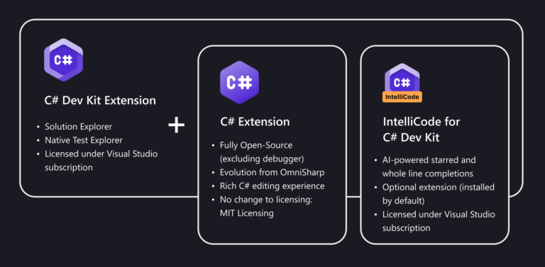
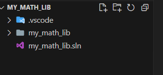
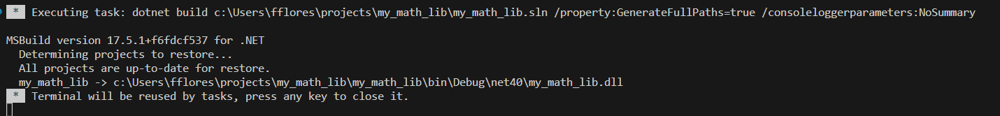
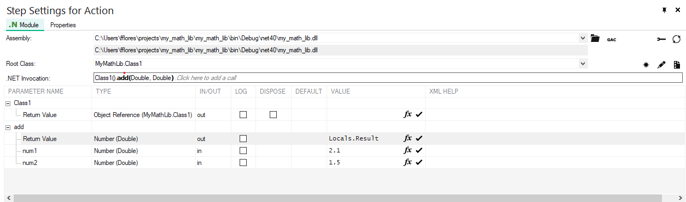
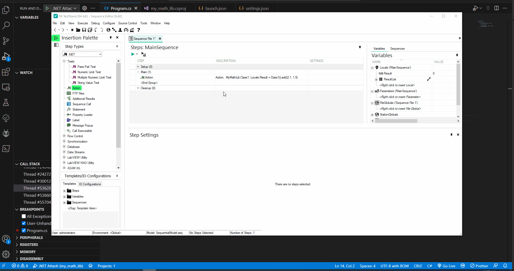
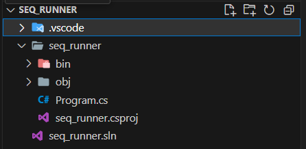
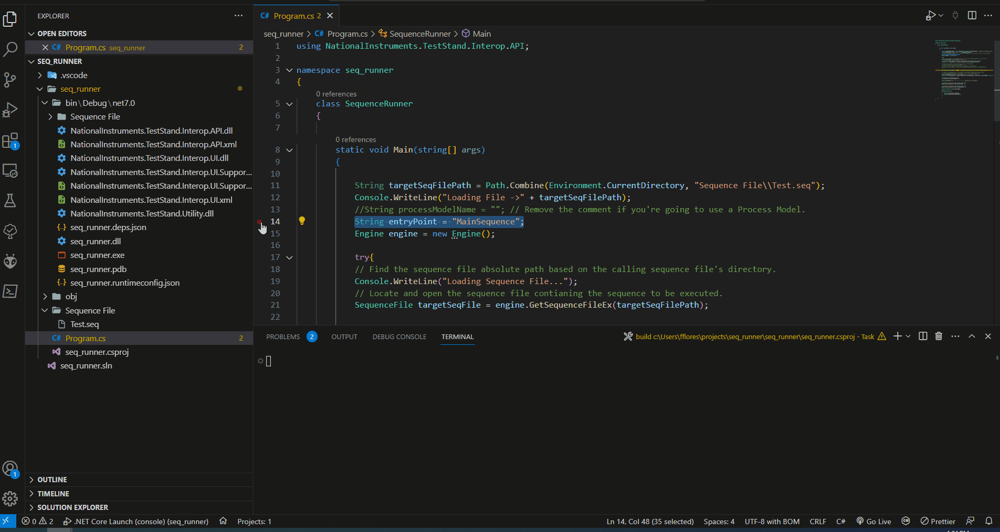

# Developing and Debugging C# Code with VS Code

## Goal

This tutorial will guide you through using Visual Studio Code to develop and debug C# .NET code modules that can be called by TestStand. You'll also learn how to create a C# CLI application that interacts with the TestStand API.

## Prerequisites

Before you begin, ensure you have the following prerequisites:

- TestStand installed (version 2022 Q4)
- [Visual Studio Code](https://code.visualstudio.com/download) installed
- [C# Extension](https://marketplace.visualstudio.com/items?itemName=ms-dotnettools.csharp) installed
- [C# Dev Kit](https://marketplace.visualstudio.com/items?itemName=ms-dotnettools.csdevkit) installed

Note: The C# Extension provides base support under the MIT License, while the C# Dev Kit enhances VS Code with additional tools for C# coding, testing, and maintenance. The Dev Kit utilizes the Visual Studio Subscription License Model.

<p align="center">
  
</p>


## Table of Contents

- [Building a C# Class Library](#building-a-c-class-library)
- [Debugging the Code Module Called by TestStand](#debugging-the-code-module-called-by-teststand)
- [Creating a C# CLI Application with the TestStand API](#c-cli-application-which-uses-the-teststand-api)
- [Troubleshooting](#troubleshooting)
- [Conclusion](#conclusion)
- [Additional Resources](#additional-resources)


### Building a C# Class Library

In this section, we'll create a C# class library and configure it for debugging.

1. Create a folder named `my_math_lib`.
2. Open VS Code from that folder by right-clicking and selecting "Open Folder in VS Code."
3. Open the Command Palette (Ctrl+Shift+P) and type **.NET: Create Project...**.
4. Select **Class Library**, name it `my_math_lib`, and save it to the default directory.
5. Confirm the source files are added to the File Explorer.

<p align="center">
  
</p>


6. Edit `my_math_lib.csproj` to target .NET Framework 4 and properly load symbols when attaching to TestStand.

```XML
<Project Sdk="Microsoft.NET.Sdk">

  <PropertyGroup>
    <OutputType>library</OutputType>
    <TargetFramework>net40</TargetFramework>
    <DebugType>portable</DebugType>
    <Optimize>false</Optimize>
  </PropertyGroup>

</Project>
```

7. Paste the following code snippet into **Program.cs**.

```C#
namespace MyMathLib
{
    public class Class1
    {
        public double add(double num1, double num2)
        {
            return num1 + num2;
        }

        public double multiply(double num1, double num2){
            return num1 * num2;
        }
    }
}
```

8. Use the Command Palette (Ctrl+Shift+P) and type **.NET: Generate Assets for Build and Debug** to create necessary files under `.vscode` for building and debugging the library.

9. Remove all configurations from `launch.json` and add the following .NET Framework configuration.

```JSON
        //use this configuration to debug code modules in TestStand
        {
            "name": ".NET Attach",
            "type": "clr",
            "request": "attach"
        }
```

10. Click on **Program.cs** to see the main code again.

11. Use the Command Palette and type **.NET: Build**. If the build is successful, the terminal should display a message like this:

<p align="center">
  
</p>


### Debugging the Code Module Called by TestStand

Learn how to debug a code module called by TestStand.

1. Place a breakpoint on line 7 of **Program.cs**.

2. Open TestStand.

3. In a new Sequence File, add an **Action** step using the .NET adapter.

4. Point to the built `my_math_lib.dll` in `bin\net40\` of your project folder.

5. Set the **Root Class** to `MyMathLib.Class1`.

6. Set the **.NET Invocation** to `Class1().add(Double, Double)`.

7. Set values for `Return Value`, `num1`, and `num2`.

8. Run the sequence using **Run MainSequence**.

<p align="center">
  
</p>


9. Observe the debugging process as demonstrated in the animation below:

<p align="center">
  
</p>


### Creating a C# CLI Application with the TestStand API

Discover how to create a C# CLI application that utilizes the TestStand API.

1. Create a folder named `seq_runner`.

2. Open VS Code from that folder by right-clicking and selecting "Open Folder in VS Code."

3. Open the Command Palette (Ctrl+Shift+P) and type **.NET: Create Project...**.

4. Choose **Console App**, name it `seq_runner`, and save it to the default directory.

5. Confirm the source files are added to the File Explorer.

<p align="center">
  
</p>

6. Edit `seq_runner.csproj` to target .NET Framework 4 and properly load TestStand API assemblies, and include a support folder for the target sequence file.

```XML
<Project Sdk="Microsoft.NET.Sdk">

  <PropertyGroup>
    <OutputType>Exe</OutputType>
    <TargetFramework>net7.0</TargetFramework>
    <ImplicitUsings>enable</ImplicitUsings>
    <Nullable>enable</Nullable>
  </PropertyGroup>
  <ItemGroup>
    <Reference Include="NationalInstruments.TestStand.Interop.API, Version=22.0.0.49152, Culture=neutral, PublicKeyToken=ad9244eb3b825cd8, processorArchitecture=MSIL">
      <HintPath>C:\Program Files\National Instruments\TestStand 2022\API\DotNET\Assemblies\CurrentVersion\NationalInstruments.TestStand.Interop.API.dll</HintPath>
      <SpecificVersion>False</SpecificVersion>
      <EmbedInteropTypes>False</EmbedInteropTypes>
    </Reference>
    <Reference Include="NationalInstruments.TestStand.Interop.UI, Version=22.0.0.49152, Culture=neutral, PublicKeyToken=ad9244eb3b825cd8, processorArchitecture=MSIL">
      <HintPath>C:\Program Files\National Instruments\TestStand 2022\API\DotNET\Assemblies\CurrentVersion\NationalInstruments.TestStand.Interop.UI.dll</HintPath>
      <SpecificVersion>False</SpecificVersion>
      <EmbedInteropTypes>False</EmbedInteropTypes>
    </Reference>
    <Reference Include="NationalInstruments.TestStand.Utility, Version=22.0.0.49152, Culture=neutral, processorArchitecture=MSIL">
      <HintPath>C:\Program Files\National Instruments\TestStand 2022\Bin\NationalInstruments.TestStand.Utility.dll</HintPath>
      <SpecificVersion>False</SpecificVersion>
    </Reference>
  </ItemGroup>
  <ItemGroup>
    <Content Include="Sequence File\**">
    <CopyToOutputDirectory>PreserveNewest</CopyToOutputDirectory>
    </Content>
  </ItemGroup>
</Project>

```

7. Create a **Sequence File** folder in the workspace root. Save a simple TestStand sequence file (e.g., displaying a pop-up dialog) as `Test.seq` in this folder.

8. Paste the code snippet into **Program.cs**.

```C#
using NationalInstruments.TestStand.Interop.API;

namespace seq_runner
{
    class SequenceRunner
    {

        static void Main(string[] args)
        {

            String targetSeqFilePath = Path.Combine(Environment.CurrentDirectory, "Sequence File\\Test.seq");
            Console.WriteLine("Loading File ->" + targetSeqFilePath);
            //String processModelName = ""; // Remove the comment if you're going to use a Process Model.
            String entryPoint = "MainSequence";
            Engine engine = new Engine();
         
            try{
            // Find the sequence file absolute path based on the calling sequence file's directory.
            Console.WriteLine("Loading Sequence File...");
            // Locate and open the sequence file contianing the sequence to be executed.
            SequenceFile targetSeqFile = engine.GetSequenceFileEx(targetSeqFilePath);
           
            /* Remove the comment if you're going to use a Process Model.
            Console.WriteLine("Loading Process Model...");
            // Locate and open the process model to be used for this execution.
            SequenceFile processModel = engine.GetStationModelSequenceFile(out processModelName);
            */

            SequenceFile processModel = null; // Comment this line if you're using a Process Model.

            // Launch a new execution of the sequence file using the specified process model.
            // The SequenceNameParameter is the name of the process model entry point
            Console.WriteLine("\nExecution Started\n-----------------------\n");
            Execution currentExecution = engine.NewExecution(targetSeqFile, entryPoint, processModel, false, 0);

            // Wait for the execution to end.
            currentExecution.WaitForEndEx(-1);

            Console.WriteLine("\n-----------------------\nExecution Finished\n");

            // Release the process model opened previously.
            engine.ReleaseSequenceFileEx(processModel, 4);

            // Release the sequence file opened previously.
            engine.ReleaseSequenceFileEx(targetSeqFile, 4);

            System.Threading.Thread.Sleep(1000);
             }
            catch(Exception ex)
            {
                Console.WriteLine(ex.Message);
                Console.WriteLine(ex.ToString());
            }

            }
    }
}

```

9. Use the Command Palette (Ctrl+Shift+P) and type **.NET: Generate Assets for Build and Debug** to create necessary files under `.vscode` for building and debugging the application.

10. Click **Run or Debug...** in the upper-right corner and select **Run project associated with this file**.

11. Check the debug log; a successful run should look like the animation below:

<p align="center">
  
</p>


#### Debugging

Debug your code by following these steps:

1. Place breakpoints in your code.

2. Click **Run or Debug...** in the upper-right corner and choose **Debug project associated with this file**.

<p align="center">
  
</p>


### Troubleshooting

Address common issues and challenges that readers may encounter.

- **Issue 1:** Description of the issue.
  - Solution or workaround.

- **Issue 2:** Description of the issue.
  - Solution or workaround.


### Conclusion

This tutorial demonstrated how to develop and debug C# modules for TestStand using Visual Studio Code. You can now confidently work with C# DLLs and create C# code that interacts with the TestStand API. By targeting the supported .NET Framework version, you can seamlessly integrate C# components into TestStand projects.


### Additional Resources

Find more information and resources to enhance your C# development with TestStand.

- [Getting Started with C# in VS Code](https://code.visualstudio.com/docs/csharp/get-started)
- [Programming with the TestStand API in C#](https://www.ni.com/docs/en-US/bundle/teststand/page/tsapiref/infotopics/csharp.htm)
- [.NET Adapter - TestStand Help](https://www.ni.com/docs/en-US/bundle/teststand/page/tsref/infotopics/net.htm)
- [TestStand API Reference Help](https://www.ni.com/docs/en-US/bundle/teststand/page/tsapiref/infotopics/teststand_api.html)


**Feedback:** Help us improve this tutorial. Please provide feedback, report issues, or suggest enhancements. :smiley:

**Author:** Felipe Flores, Senior Technical Support Engineer at NI.

**Last Updated:** August 15th, 2023.
