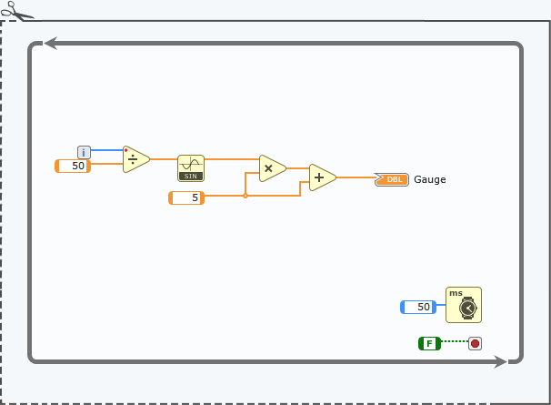

# Developing and Debugging JavaScript Code with VS Code

## Goal

G Web Development Software, the NI tool for developing HTML 5 based front-panels, allows for integration with JavaScript to add custom functionality to WebVIs. Through JavaScript Library Integration, you can call JS functions as SubVIs, which can be found in the functions palette. G Web also permits adding custom Cascade Style Sheet (CSS) files to customize the look of UI elements.

In this tutorial, we'll use VS Code to create and edit both CSS and JavaScript files for a G Web Dev Project. Additionally, we'll utilize Live Server to receive live updates of your JavaScript code edits.

## Prerequisites

- [Install Visual Studio Code](https://code.visualstudio.com/download).
- [Install the Live Server extension](https://marketplace.visualstudio.com/items?itemName=ritwickdey.LiveServer).


## Index


- [Customizing WebVI Control using CSS and JavaScript](#customizing-webvi-control-using-css-and-javascript)
- [Using VS Code to Experiment with Control Customizations](#using-vs-code-to-experiment-with-control-customizations)


### Customizing WebVI Control using CSS and JavaScript

In G Web Dev, you can customize every aspect of a UI control using CSS and modify it at runtime using JavaScript. In this tutorial, we'll customize a Gauge control to change the needle, line, and fill colors based on specific thresholds. In VS Code, we'll create a JavaScript function that dynamically sets the color of the CSS elements based on lower limit, upper limit, and current value parameters.

1. Open G Web Development Software.
2. Create a new Web Application Project named `customizing_web_control`.
3. Open the **index.gviweb** file and add a Gauge control to the Front Panel.
4. In the **Item** properties pane, enter `custom-gauge` in the **HTML class attribute** field and select `Fill` for the **Display Type**.
5. In the **Behavior** section, set the **Minimum** to `0` and the **Maximum** to `10`.
6. Create the following block diagram to set the value of the Gauge. Save the File.

<p align="center">
  
</p>diagram here]

> **Note:** You can run the Web VI too see the run-time behavior behavior of the Gauge.

7. Open the gcomp folder by right-clicking it and selecting **Locate in Windows Explorer**.

8. Right-click the folder, then select **Open Folder in VS Code**.

From now on, we'll use VS Code to create and edit CSS and JavaScript code.

7. Create two new namespaces in the root workspace: **css** and **js**.

10. Create a new file and save it in the **css** folder as `custom-styles.css`.

11. Paste the following snippet into the newly created CSS file.

```CSS
.custom-gauge .jqx-value {

 stroke: transparent;
 stroke-width: 0px;
 fill: red;
}
```

12. Create another new file and save it in the **js** folder as `change-color.js`.

13. Paste the following snippet into the newly created JavaScript file.

```JavaScript
// This JavaScript function changes the color of the Gauge control display
// It basically changes the color attribute in the CSS object loaded at run-time.

function change_gauge_color(value, max, min){

    //Gets the cssStyleSheet Object
    
    var css_list = document.styleSheets;

    
    //rules of ranges and colors. You can change it to meet your needs.
    // Probably is not the best logic, but it works. Feel free to improve it.
    
    if (value < min) {
        css_list[2].cssRules[0].style["fill"] = "red";
    } else if (value >= min && value < max) {
        css_list[2].cssRules[0].style["fill"] = "yellow";
    }else if (value >= max){
        css_list[2].cssRules[0].style["fill"] = "green";
    }
    
}
```
Now, let's link both the CSS and JavaScript files to the Web VI.

14. In G Web Dev, open the HTML code of the **index.gviweb** and click **Edit HTML Source (</>)**. In the <head></head> tags, add the following lines of code after the `<style ni-autogenerated-style-id=""></style>` tags. 

```HTML
        <!--- CSS that customizes the gauge control based on tis HTML class attribute -->
        <link rel="stylesheet" href="css/custom-styles.css">
      
```

15. Save the file.

16. Notice that G Web Dev did not include the **css** and **js** folders, so make sure create two new namespaces with the same name **(Right-Click WebApp.gcomp >> Add namespace)** and import the files inot them **(Right-Click >> Import Files)**.

Your project structure should look like this:

<p align="center">
  
</p>

17. Create a new JavaScript Library under WebApp.gcomp (Right-Click >> New >> JavaScript Library Interface) and name it `custom_control_lib.jsli`.

18. Add the following HTML snippet at the end of the template comment in **HTML script and link dependencies.**

```HTML
		<!--- Javascript file containing a function that dynamically changes the gauge display color-->
        <script type="text/javascript" src="js/change-color.js"></script>
```

19. Open `custom_control_lib` and add a new function called `change_gauge_color`. Set the inputs and outputs as shown in the table below:

<div style="display: flex; justify-content: center;">
  <table>
    <thead>
      <tr>
        <th>Name</th>
        <th>Data Type</th>
        <th>Representation</th>
        <th>Input/Output</th>
      </tr>
    </thead>
    <tbody>
      <tr>
        <td>return</td>
        <td>void</td>
        <td>-</td>
        <td>output</td>
      </tr>
      <tr>
        <td>value</td>
        <td>Numeric</td>
        <td>8-byte double</td>
        <td>input</td>
      </tr>
      <tr>
        <td>max</td>
        <td>Numeric</td>
        <td>8-byte double</td>
        <td>input</td>
      </tr>
      <tr>
        <td>min</td>
        <td>Numeric</td>
        <td>8-byte double</td>
        <td>input</td>
      </tr>
    </tbody>
  </table>
</div>

   
   > **Note:** You can define a custom icon if desired.

20. Open the WebVI block diagram and from the functions palette, select **Project Items >> Software >> WebApp >> custom_control_lib >> Change_gauge_color**.

21. Add it to your block diagram. Connect two numeric controls to **min** and **max** and connect the same input as the Gauge indicator to **value**. Your Block Diagram and Front Panel should resemble the screenshots below.


  |              Block Diagram               |              Front Panel             |
  | :---------------------------------------:| :-----------------------------------:|
  |||


22. On the Front Panel, set the **min** to `3` and the **max** to `8`. Set those values as default **(Right-Click >> Make Current Value Default)**

23. Run the Web VI. Observe how the fill color changes depending on the current value.

<p align="center">
  
</p>


### Using VS Code to Experiment with Control Customizations

While G Web Dev doesn't offer live updates when customizing CSS and JavaScript files, we can use the Live Server Extension to publish the WebVI and update the UI as you modify the JavaScript code.

1. In G Web Deb, build **WebApp.gcomp**. Open the build destination folder in VS Code.

2. Open the `index.html` file. Then, click the **Go Live** button on the lower status bar. VS Code will load the live server and open the WebVI in your default browser.

<p align="center">
  
</p>

3. Open **change-color.js**, change the color constants and save the file. Observe how the colors of the gauge automatically update. To stop the live server, click on **Live on Port: 5000**.

> **Note:** Whenever you make changes to the WebApp files, the server will automatically refresh the web page. If you modify the WebVI in G Web and rebuild the gcomp, the Live server will detect it and refresh the page automatically.

**Challenge:** If you set the Display Type to Needle, the CSS element carrying the color attribute will be `.jqx-needle`. Modify the project files to change the color of the needle.

## Troubleshooting

If you encounter common issues or challenges, you can find solutions or workarounds below:

- **Issue 1:** Description of the issue.
  - Solution or workaround.

- **Issue 2:** Description of the issue.
  - Solution or workaround.


## Conclusion

VS Code is a valuable tool for streamlining the workflow of customizing UI Controls in G Web Dev. Additionally, the Live Server extension comes in handy when experimenting with attributes that automatically update the web page as soon as you save the project files.

## Additional Resources

Here are some additional resources, references, or links that readers might find useful or interesting:

- [Using JavaScript with a Web Application](https://www.ni.com/docs/en-US/bundle/g-web-development/page/javascript-web-application.html)
- [JavaScript in Visual Studio Code](https://code.visualstudio.com/docs/languages/javascript)
- [Customize WebVIs with CSS](https://ni.github.io/webvi-examples/CustomizeWithCss/Builds/WebApp_Default%20Web%20Server/)
- [Customizing the Appearance of Controls in a WebVI](https://www.ni.com/docs/en-US/bundle/g-web-development/page/customizing-appearance-controls-webvi.html)


**Feedback:** Help us improve this tutorial. Please provide feedback, report issues, or suggest enhancements. 😃

**Author:** Felipe Flores, Senior Technical Support Engineer at NI.

**Last Updated:** August 21st, 2023.
