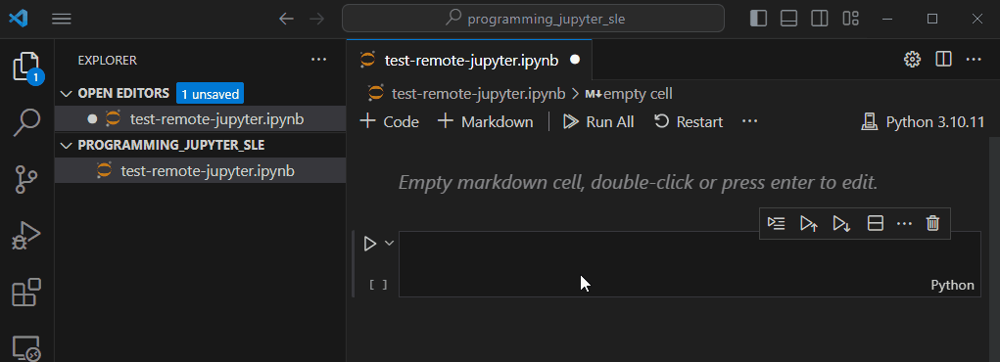

# Developing and Debugging Jupyter Notebooks with VS Code

## Goal

This document will walk you through the process of linking your local VSCode environment to a remote Jupyter Application installation that comes with SystemLink Enterprise. By establishing this connection, you can utilize the debugging features of VSCode to develop and troubleshoot your notebooks, allowing you to view the outcomes locally before transferring the analysis script to the server. While you will be creating and modifying the notebook on your local machine, the code execution occurs on the remote Python kernel, enabling you to access all SystemLink-specific modules without the need for local installation.

## Prerequisites

- Install [Visual Studio Code](link_to_installation_page).
- Install [Jupyter Notebooks](link_to_extension_page) extension.
- Access to a [SystemLink Enterprise](url) instance.


## Index

- [Setup Remote Jupyter Development for SystemLink Enterprise](#setup-remote-jupyter-development-for-systemlink-enterprise)
- [Setup Remote Jupyter Development for SystemLink Server](#setup-remote-jupyter-development-for-systemlink-server)


### Setup Remote Jupyter Development for SystemLink Enterprise

SystemLink Enterprise provides official support for remote developing Jupyter Notebooks. Here are the steps to do so:

### Setting Up Remote Jupyter Development for SystemLink Enterprise

SystemLink Enterprise (SLE) offers official support for remotely developing Jupyter Notebooks. Here's how you can set it up:

1. Open the [Jupyter application on SLE](https://test.lifecyclesolutions.ni.com/jupyter/).

2. From the Jupyter UI, click the **File >> Generate server URL for remote development** located in the lower part of the dropdown.

3. Copy the URL displayed on the pop-up dialog.

__Note:__ the URL structure is `https://<server_url>/jupyterhub/user/<e_mail_username>/?token=<jupyter_specifc_token>`

4. In VS Code, create a new workspace (folder) and save it as `programming_remote_jupyter`.

5. Open the Command Palette (Ctrl+Shift+P) and Type `Create: New Jupyter Notebook`

> __Note:__ You don't actually need to type the whole command. If you type `New Jupy`the command will appear for you.

6. Save the file as `test-remote-jupyter.ipynb`.

7. With the Notebook open, notice that there is a Kernel Selector button at the upper-right hand corner. Click on it on **Select Another Kernel** and **Select Remote Kernel** at the top of VS Code UI.

8. Paste the URL you obtained from SLE and hit enter. If asked for user name and password, just hit Enter over again. You can change the Server Display Name if you want.

9. Select the python Kernel from SLE. Notice that the Kernel Selector button now points to the remote kernel.

10. Validate the conneciton by running the following python code in a Jupyter Notebook Cell.

```Python

import os
base_url = os.getenv("SYSTEMLINK_HTTP_URI")
print(base_url)

```

The string printed should be `https://<your-sle-servere-address>` 

The animation below reproduces steps 7 to 10.

<p align="center">
  
</p>

> **Notes:** 
>- The token within the provided URL has a limited lifespan. When your current user session ends (due to logging out or the pod being deleted for inactivity), a new token will replace the old one. You can always retrieve a new token by following the first step mentioned.
>- If you need a token that remains valid across multiple logins, you can go to "File" -> "Hub Control Panel" and then click on "Token" in the upper left corner of the page. Generate new tokens there and replace the existing one in the URL (replace everything after "?token=" with the new token).


### Setup Remote Jupyter Development for SystemLink Server

> __Note:__ There is not a validated set of steps for this yet. I'll update this article as soon as I have it.

### Troubleshooting

- **Issue 1:** Connection fails in VS Code
    The pod might be inactive. The time in which a pod gets inactive is preset: 30 seconds if idle and no kernels open and 15 minutes if idle and at least one kernel open. You can ensure the pod doesn't get inactive by keeping open (and visible on the screen) the JupyterHub browser tab, as that is seen as activity.

- **Issue 2:** You might run into errors when adding the connection string for the remote Kernel. If that happens, try to add the URL, username and password individually. `https://<server_url>/jupyterhub/user/<e_mail_username>/?token=<jupyter_specifc_token>`


## Conclusion

VS Code streamlines your Jupyter Notebook for SystemLink Enterprise (SLE) development workflow. It seamlessly connects to the SLE's Jupyter server, allowing you to harness the power of SystemLink APIs. Additionally, VS Code provides an enhanced debugging environment and robust Source Code Control features.


## Additional Resources

- [Connect to a remote Jupyter server - VS Code Docs](https://code.visualstudio.com/docs/datascience/notebooks-web#:~:text=run%20your%20code.-,Connect%20to%20a%20remote%20Jupyter%20server,for%20your%20remote%20Jupyter%20server.)


**Feedback:** Help us improve this tutorial. Please provide feedback, report issues, or suggest enhancements. :smiley:

**Author:** Felipe Flores, Senior Technical Support Engineer at NI.

**Last Updated:** November 21st, 2024.

