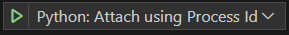
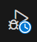
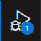

# Debugging code called from Python node in LabVIEW using VS Code

## Goal

In this tutorial, we will learn how to debug a python code called by LabVIEW using the [Python](https://www.ni.com/docs/en-US/bundle/labview-api-ref/page/menus/categories/computer/python-node-mnu.html) nodes.

## Prerequisites

List any prerequisites or requirements that readers should have before starting the tutorial.

- Install a supported version of [Python](https://www.python.org/downloads/). Refer to the [TestStand Readme](https://www.ni.com/pdf/manuals/teststand-2022-q4.html#:~:text=Python%20Support,3.6%20or%20earlier) for supported Python versions.
- Install the debugpy python module. You may use the `pip install debugpy` command if your python installation comes with pip.
- Install [Visual Studio Code](https://code.visualstudio.com/download)
- Install the [Python Extension](https://marketplace.visualstudio.com/items?itemName=ms-python.python).
- Install [LabVIEW](https://www.ni.com/en/support/downloads/software-products/download.labview.html#487445)

> **Note:** Check the [LabVIEW and Python Compatibility](https://www.ni.com/en/support/documentation/supplemental/18/installing-python-for-calling-python-code.html#:~:text=Additional%20Resources-,LabVIEW%20and%20Python%20Compatibility,-Use%20the%20following) for picking a supported combination.

## Index

Provide a list of sections or topics covered in your document. Include links to the corresponding sections for easy navigation.

- [Debugging Code Called from Python Node in LabVIEW](#debugging-code-called-from-python-node-in-labview)

---

## Debugging Code Called from Python Node in LabVIEW

This section covers the process of debugging code that is called from a Python node in LabVIEW.

For information on LabVIEW and Python compatibility, refer to [LabVIEW and Python Compatibility](https://www.ni.com/en/support/documentation/supplemental/18/installing-python-for-calling-python-code.html).

1. Create a folder named `debugging_python_labview`.
2. Open the folder, right-click, and select **Open Folder in VS Code**.
    - The name of this menu item might vary depending on your VS Code version.

3. Open the Command Palette (Ctrl+Shift+P) and type `New File`.
4. Choose Python File and save it as `python_node_example.py`.
5. Paste the following code snippet into the newly created python file.

```Python
def add(a, b):
    """
    Add two numbers.

    Parameters:
    a (float or int): The first number.
    b (float or int): The second number.

    Returns:
    float or int: The sum of a and b.
    """
    return a + b

def multiply(a, b):
    """
    Multiply two numbers.

    Parameters:
    a (float or int): The first number.
    b (float or int): The second number.

    Returns:
    float or int: The product of a and b.
    """
    return a * b

def show_process_id():
    """
    Display the process ID of the current running program.

    Returns:
    int: The process ID.
    """
    import os
    import ctypes
    ctypes.windll.user32.MessageBoxW(None, "Process name: niPythonHost.exe and Process ID: " + str(os.getpid()), "Attach debugger", 0)
    return os.getpid()

```

> **Note:** According to the KB [Calling Python Class Methods Using Python Node in LabVIEW 2018](https://knowledge.ni.com/KnowledgeArticleDetails?id=kA00Z0000019UFmSAM&l=en-US), instantiating classes is not yet supported with the Python Node.

6. Click the **Run and Debug** button (Ctrl+Shift+D).
7. Click the link to create a **launch.json file**.
8. Select **Attach using Process ID - Attach to a Local Process**.
9. Confirm that a `.vscode` folder with a `launch.json` file is created. This configuration is intended for attaching the VS Code debugger to an existing Python process by selecting its process ID from a list of available processes.

> **Note:** `launch.json` is a configuration file used to define how you want to launch and debug your code in Visual Studio Code.

10. Set a breakpoint on line 12, where the function `add` returns.

11. Open LabVIEW and create a new VI. Save it as `python_caller.vi` in the same directory where you saved the python file.

12. Code your VI as shown in the snippet below:

<p align="center">
  
</p>

13. Run the VI.

14. The `Get Process ID for Python Debugger` step will display a pop-up with the process ID number. **Do not click the OK button yet.**

15. Switch to VS Code, open the python file, and click the **Run and Debug** button (Ctrl+Shift+D), then click the **Start Debugging** button .

16. Enter the process ID number that LabVIEW provided and press Enter. Wait for the debugger to finish launching.

> **Note:** During the attachment of the debugger, you'll see a "busy" icon on the **Run and Debug** button . When the process is complete, the icon will change to .

17. Return to LabVIEW and click OK on the Process ID dialog. The VI will execute normally.

18. Notice that the execution will break whenever it reaches the breakpoint you set in VS Code.

19. You can now use the VS Code debugging tools to analyze your Python code.

---

### Troubleshooting

If there are common issues or challenges that readers might encounter, list them here along with possible solutions or workarounds.

- **Issue 1:** Description of the issue.
    - Solution or workaround.

- **Issue 2:** Description of the issue.
    - Solution or workaround.

---

### Conclusion

Debugging code called from a Python node in LabVIEW involves a combination of tools and steps to ensure seamless integration between LabVIEW and Python environments. By following the outlined process, you can effectively troubleshoot and analyze your Python code within the familiar environment of Visual Studio Code. This enables a streamlined development workflow and empowers you to create more robust and sophisticated applications that harness the capabilities of both LabVIEW and Python. Embrace the power of debugging to enhance your coding experience and create solutions that bridge the gap between these two powerful languages.


---
### Additional Resources

List any additional resources, references, or links that readers might find useful or interesting.

- [How to Debug Python Code Called From LabVIEW Python Node](https://knowledge.ni.com/KnowledgeArticleDetails?id=kA03q0000019hP1CAI&l=en-US#:~:text=On%20LabVIEW%20side%2C%20put%20a,choose%20the%20NIPythonHost.exe%20process.)
- [Python Debugging in VS Code](https://code.visualstudio.com/docs/python/debugging)


---

**Feedback:** Help us improve this tutorial by providing feedback, reporting issues, or suggesting enhancements. :smiley:

**Author:** Felipe Flores, Senior Technical Support Engineer at NI.

**Last Updated:** August 16th, 2023.
