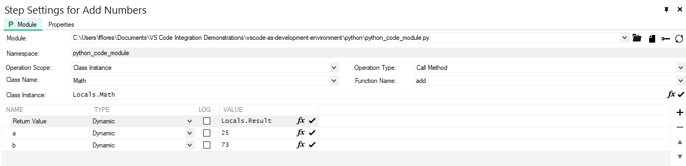

# Developing and Debugging Python Code Modules for TestStand

## Goal

TestStand offers two approaches to debugging python modules: Stepping into a Python module and Attaching to an external process. Let's explore both methods from the perspective of VS Code.

## Prerequisites

### Installation

- Install a supported version of [Python](https://www.python.org/downloads/). Refer to the [TestStand Readme](https://www.ni.com/pdf/manuals/teststand-2022-q4.html#:~:text=Python%20Support,3.6%20or%20earlier) for a list of supported Python versions.
- Install the `debugpy` python module. You can use the command `pip install debugpy` if your python installation includes pip.
- Install [Visual Studio Code](https://code.visualstudio.com/download).
- Install the [Python Extension](https://marketplace.visualstudio.com/items?itemName=ms-python.python) for Visual Studio Code.
- Install [TestStand 2021 SP1 or later](https://www.ni.com/en/support/downloads/software-products/download.teststand.html#467601).
- Install the **NI TestStand Support for Debugging Python Code** by opening TestStand Version Selector and clicking **Activate** or **Configure** for TestStand 2021 SP1 or later.

### Configure a Trusted Directory in VS Code

1. Add `C:\<My Documents>\TestStand\Python` as a trusted folder.
    - Create this folder if it doesn't exist.
    - Open the Command Palette in VS Code (Ctrl+Shift+P) and type `Workspaces: Manage Workspace Trust`.
    - Scroll down and verify if the folder is listed as trusted. If not, click the **Add Folder** button at the bottom of the page and manually add it.

## Index

Provide a list of sections or topics covered in your document with links for easy navigation.

- [Stepping into Python Modules](#stepping-into-python-modules)
- [Attaching to the niPythonHost process](#attaching-to-the-nipythonhost-process)
- [Troubleshooting](#troubleshooting)
- [Conclusion](#conclusion)

---

### Stepping into Python Modules

In this approach, TestStand installs the **NI TestStand Support for Debugging Python Code** extension, enabling the ability to step into code modules. This extension loads the appropriate python module and pauses execution when stepping into a Python step in TestStand.

> **Note:** You cannot install the NI TestStand Support for Debugging Python Code from the Extension Marketplace (Ctrl+Shift+X) in VS Code. It's not searchable; you need to scroll through the list of installed extensions to find it.

<p align="center">
  
</p>

Follow the steps below to use this debugging approach:

1. Create a folder named `debugging_python_teststand`.
2. Open the folder, right-click, and select **Open Folder in VS Code**.
    - The name of this menu item might vary depending on your VS Code version.
3. Open the Command Palette (Ctrl+Shift+P) and type `New File`.
4. Choose Python File and save it as `python_code_module.py`.
5. Paste the following code snippet into the newly created python file.

```Python
import os
import ctypes
 
class Debug:
    """
    A utility class for debugging purposes.
    """

    @staticmethod
    def show_process_id():
        """
        Display the process ID of the current running program.

        Returns:
        int: The process ID.
        """
        import os
        import ctypes
        ctypes.windll.user32.MessageBoxW(None, "Process name: niPythonHost.exe and Process ID: " + str(os.getpid()), "Attach debugger", 0)
        return os.getpid()
        

class Math:
    """
    A simple class for performing basic mathematical operations.
    """

    def add(self, a, b):
        """
        Add two numbers.

        Parameters:
        a (float or int): The first number.
        b (float or int): The second number.

        Returns:
        float or int: The sum of a and b.
        """
        return a + b

    def multiply(self, a, b):
        """
        Multiply two numbers.

        Parameters:
        a (float or int): The first number.
        b (float or int): The second number.

        Returns:
        float or int: The product of a and b.
        """
        return a * b
    
    
```

> **Note:** Our focus is on learning how to use VS Code with TestStand, so the code snippet will not be overly complex.

6. Save the python file.
7. Launch the active version of TestStand.
8. Create a new Sequence File and save it as `debugging_python_modules.seq`.
9. Add an action step using the Python adapter to the MainSequence.
10. Name it `Create Math Object`.
11. Create a **object reference** local variable named `Math` (Locals.Math).
12. Configure the step as shown below:

<p align="center">
  
</p>

> **Note:** We must create an instance of the Math class so we can invoke methods from it. This allows us to create independent instances of Math and operate on them individually. If we want to avoid this, static methods should be created in the class. We'll explore this in the next section.

13. Create an action step named `Add Numbers`.
14. Configure the step as shown below:

<p align="center">
  
</p>

> **Note:** Remember that the path to the python file might differ from the screenshot.

Now, let's run the sequence and step into the `Add Numbers` step.

15. Place a breakpoint at a step that calls a Python module.
    - **Note:** If you skip this breakpoint and attempt to step into the Python Module, TestStand won't invoke VS Code.

16. Select **Execute >> Run MainSequence**. The execution pauses at the Python step.
17. Click the **Step Into** button at the top of the Execution window. VS Code becomes active, with the Python module open and in a suspended state.

> **Note:** The VS Code window might not come to the front position. If this happens, check the Windows taskbar for the VS Code application.

18. Click **Step Into** or **Step Over** on the VS Code toolbar to start stepping through the function. You can click **Continue** at any time to finish stepping through the module and return to TestStand.
19. Click the **Resume** button on the Execution toolbar in TestStand to complete the execution.

The animation below illustrates steps 15 to 19.

<p align="center">
  
</p>

---

### Attaching to the niPythonHost process

Python code modules are executed in an external process on the system where the Python interpreter is hosted (niPythonHost). You can attach the Python debugger to this external process.

In this tutorial, we'll use the **Debug** class to obtain the niPythonHost process ID and then attach the Python Debugger in VS Code to it.

1. If not already open, open the `debugging_python_modules` workspace in VS Code.
2. Click **Run and Debug** (Crtl+Shift+D) in VS Code.
3. Click the link to create a **launch.json file**.
4. Select **Attach using Process ID - Attach to a Local Process**.
5. Confirm the creation of a `.vscode` folder with a `launch.json` file. This configuration is intended for attaching the VS Code debugger to an existing Python process by selecting its process ID from a list of available processes.

> **Note:** `launch.json` is a configuration file used to define how you want to launch and debug your code in Visual Studio Code.

6. Set a breakpoint on line 38, where the Add method returns the sum of a+b.

> **Note:** Hover over line numbers to manage breakpoints.

7. In TestStand, open the `debugging_python_modules.seq` if it's not already open.
8. Add a new action step to the **Setup** group. Name it `Get Process ID for Python Debugger`.
9. Configure the module as shown below:

<p align="center">
  
</p>

10. Remove any breakpoints from the sequence file.
11. Run the sequence with **Run MainSequence**.
12. The `Get Process ID for Python Debugger` step will display a pop-up with the process ID number. **Do not click the OK button yet.**
13. Switch to VS Code, open the python file, click **Run and Debug** (Ctrl+Shift+D), and click the **Start Debugging** button .
14. Enter the process ID number that TestStand provided and press Enter. Wait for the debugger to finish launching.

> **Note:** During the attachment of the debugger, you'll see a "busy" icon on the **Run and Debug** button . When the process is complete, the icon will change to .

15. Return to TestStand and click OK on the Process ID dialog. The test will execute normally.
16. Notice that the execution breaks whenever it reaches the breakpoint you set in VS Code.
17. You can now utilize the VS Code debugging tools to analyze your Python code.

> **Challenge:** Try repeating this process for the **Multiply** class.

---

### Troubleshooting

Here are some common issues readers might encounter, along with possible solutions or workarounds.

- **Issue 1:** Description of the issue.
    - Solution or workaround.

- **Issue 2:** Description of the issue.
    - Solution or workaround.

---

### Conclusion

In this document, you've learned how to develop and debug Python code modules in TestStand using VS Code. By exploring two debugging approaches—stepping into Python modules and attaching to an external process you can streamline your development and troubleshooting process.

> **Note:** Feel free to explore additional features and tools in both TestStand and VS Code to enhance your Python development workflow.

---

### Additional Resources

For more information and references, check out these resources:

- [Python Adapter](https://www.ni.com/docs/en-US/bundle/teststand/page/tsref/infotopics/python.html)
- [Debugging Python Modules](https://www.ni.com/docs/en-US/bundle/teststand/page/tsref/infotopics/debugging_python_module.html)
- [Python Debugging in VS Code](https://code.visualstudio.com/docs/python/debugging)

---

**Feedback:** Help us improve this tutorial by providing feedback, reporting issues, or suggesting enhancements. :smiley:

**Author:** Felipe Flores, Senior Technical Support Engineer at NI.

**Last Updated:** August 16th, 2023.