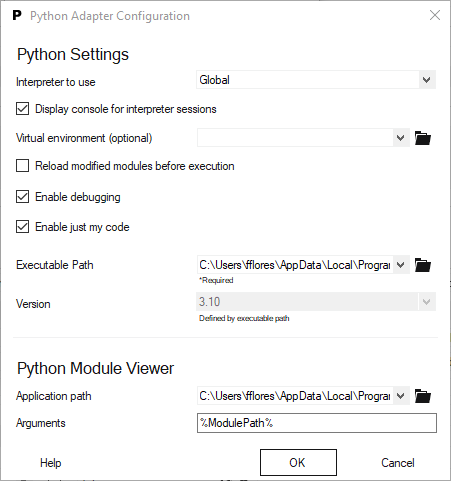
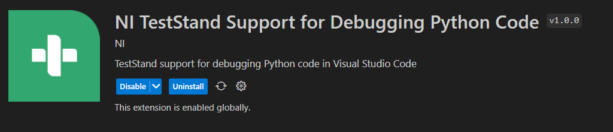
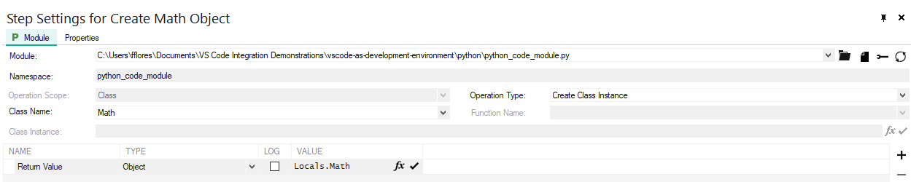
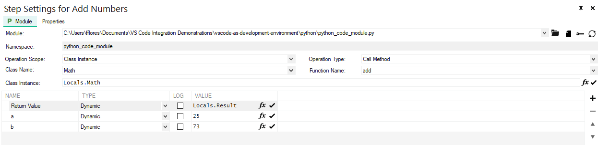
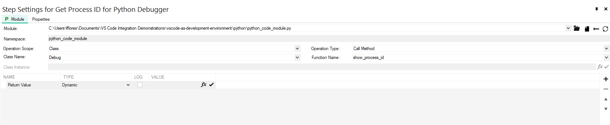
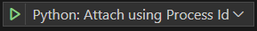
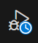
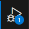

# Developing and Debugging C# Code with VS Code

---
## Goal

In this tutorial, you'll learn how to use VS Code to create python scripts that can integrate with TestStand and LabVIEW and also how to consume web services from SystemLink.

---
## Prerequisites

### Install

- Install a supported version of [Python](https://www.python.org/downloads/). Refer to the [TestStand Readme](https://www.ni.com/pdf/manuals/teststand-2022-q4.html#:~:text=Python%20Support,3.6%20or%20earlier) for supported Python versions.
- Install the debugpy python module. You may use the `pip install debugpy` command if your python installation comes with pip.
- Install [Visual Studio Code](https://code.visualstudio.com/download)
- Install the [Python Extension](https://marketplace.visualstudio.com/items?itemName=ms-python.python).
- Install [TestStand 2021 SP1 or later](https://www.ni.com/en/support/downloads/software-products/download.teststand.html#467601).
- Install the **NI TestStand Support for Debugging Python Code**, by opening TestStand Version Selector and click **Activate** or **Configure** on TestStand 2021 SP1 or later.

### Configure a Trusted Directory in VS Code

1. Add `C:\<My Documents>\TestStand\Python` as a trusted folder.
- - Crete that folder if it doesn't exists.
- - In VS Code, open the Command Palette (Ctrl+Shift+P) and type `Workspaces: Manage Workspace Trust`
> **Note:** You don't actually need to type the whole command. If you type `Workspace Trust` this option will come up to you.
- - Scroll down the page and check if the folder is listed as tursted. If it is not, click the **Add Folder** button at the bottom of the page and manually add it to this list.

  

### Configure the Python Adapter for Debugging

1. In TestStand, click **Configure >> Adapters...**, select **Python**, and click **Configure...**.
2. Select the **Enable Debugging** option.
3. Select **Enable Just My Code** to debug only your Python code and exclude installed libraries when debugging.
5. For the **Executable Path** option, browse to the location of `python.exe` you want to use to debug Python modules. The version number of the executable must match the version number in the **Version** option.

  

---
## Index

- [Developing and debugging Python code modules for TestStand](#developing-and-debugging-python-code-modules-for-teststand)
- [Debugging code called from Python node in LabVIEW](#debugging-code-called-from-python-node-in-labview)
- [Consuming SystemLink web services using the Requests module](#consume-systemlink-web-services-using-the-requests-module)
- [Troubleshooting](#troubleshooting)
- [Conclusion](#conclusion)
- [Additional Resources](#additional-resources)

> **Note:** This series of tutorials will focus mostly on the interaction of VS Code with NI Software. Check the Additional Resources section for the official documentation of the python support in Python and LabVIEW.

---
## Developing and debugging Python code modules for TestStand

In the TestStand help, NI provides two ways of debugging python modules: Stepping into a Python module and Attaching to the niPythonHost process. Let's see how both approaches from the perspective of VS Code.

### Stepping into Python Modules

In this approach, TestStand will install **NI TestStand Support for Debugging Python Code** to allow stepping into the code module. This extension will load the proper python module and break the execution when you step into a Python step in TestStand.

> **Note:** The NI estStand Support for Debugging Python Code cannot be installed from the Extension Marketplace (Ctrl+Shift+X) in VS Code. It is also not searchable, so you have to scroll through the list of installed extensions to see it.

  

Go through the steps below to use this debugging approach

1. Create a folder called `debugging_python_modules`.
2. Open the folder, right-click and select the **Open Folder in VS Code**

> **Note:** The name of this menu item may change, depending on the VS Code version you use.

3. Open the Command Palette (Ctrl+Shift+P) and type `New File`.
4. Select Python File and save it as `python_code_module.py`
5. Paste the following code snippet on the recently created python file.

[code snippet]

> **Note:** Keep in mind that our focus here is to learn how to use VS Code with TestStand, thus we won't have a super complex code.

6. Save the python file.
7. Launch the active version of TestStand.
8. Create a new Sequence File and save it as `debugging_python_modules.seq`
9. Add an action step that uses the Python adapter to the MainSequence.
10. Name it `Create Math Object`.
11. Create an **object reference** local variable named `Math` (Locals.Math)
11. Configure the step as shown below:

  

> **Note:** We must create an instance of the Math class so we can then invoke the methods from that class. This allows us to create several, indenependent instances of Math and operate on them individually. If we want to avoid this, we must create static methods in the class. We'll see this in the next session.

12. Create a action step and name it `Add Numbers`.
13. Conifgure the step as shown below:

  

> **Note:** Don't forget the path to the python file will differ from the screenshot.

Now, we are going to run the sequence and step into the `Add Numbers` step

14. Place a breakpoint at a step that calls a Python module.

> **Note:** If you don't place this breakpoint and step into the Python Module, Teststand will not call VS Code.

15. Select **Execute >> Run MainSequence**. The execution pauses at the Python step.
16. Click the **Step Into** button at the top of the Execution window. VS Code becomes the active application, in which the Python module is open and in a suspended state.

> **Note:** The VS Code window might not go to the frontmost position. if that happens to you, check the windows taskbar for the VS Code Application.

17. Click **Step Into** or **Step Over** on the VS Code toolbar to begin stepping through the function. You can click **Continue** at any time to finish stepping through the module and return to TestStand.
18. Click the **Resume** button on the Execution toolbar in TestStand to complete the execution.

The animation below illustrates steps 14 to 18.

  

### Attaching to the niPythonHost process

Python code modules are executed in an external process on the system where the Python interpreter is hosted (niPythonHost). You can attach the Python debugger to the external process.

In this tutorial, we're going to use the **Debug** class to get the niPythonHost process Id and attach Python Debugger in VS Code to it.

1. In VS Code, open the `debugging_python_modules` workspace if it is not opened.
2. In VS Code, click the the **Run and Debug** (Crtl+Shift+D).
3. Click the create a **launch.json file** link.
4. Select **Attach using Process ID - Attach to a Local Process**
5. Check that a `.vscode` folder with a `launch.json` file with it was created. this configuration is intended to be used when you want to attach the VS Code debugger to an existing Python process by selecting the process ID from a list of available processes.

> **Note:**`launch.json` is configuration file used to define how you want to launch and debug your code in Visual Studio Code.

6. Place a breakpoint on line 38, on which the Add method returns the sum of a+b.

> **Note:** Hover over line numbers to manage breakpoints.

7. In TestStand, open the `debugging_python_modules.seq` if it is not opened.
8. Add a new action step to the **Setup** group. Name it `Get Process ID for Python Debugger`.
9. Configure the module as shown below:

  

10. Remove any breakpoints from the sequence file
11. Run the sequence with **Run MainSequence**.
10. the  `Get Process ID for Python Debugger` will throw a pop-up with the process ID number. do not click the OK button yet.
11. Switch to VS Code, open the python file and click the **Run and Debug** (Ctrl+Shift+D) and click the **Start Debugging** button 
12. Enter the number of the process ID TestStand gave you and hit enter. Wait until the debugger finishes launching.

> **Note:** while the debugging is being attached, you'll see a "busy" icon on the **Run and Debug** button . When this process finishes, the icon will change 

13. Switch back to TestStand and click OK on the Process ID dialog. The test will execute normally.
14. Notice that the execution will break whenever it hits the breakpoint you defined in VS Code.
15. Now you can use the VS Code debugging tools to analyze your python code.

> **Challenge:** Try repeating this process, but for the **Multiply** class.

---
### Debugging code called from Python node in LabVIEW

Provide a brief introduction or description of the topic covered in this section.

1. Step 1 description.
    - Detailed instructions.
    - Optional sub-steps if needed.
    - Any additional notes or tips.

2. Step 2 description.
    - ...

> **Note:** Include any relevant notes, warnings, or tips that readers should be aware of during this section.

---
### Consuming SystemLink web services using the Requests module

Provide a brief introduction or description of the topic covered in this section.

1. Step 1 description.
    - Detailed instructions.
    - Optional sub-steps if needed.
    - Any additional notes or tips.

2. Step 2 description.
    - ...

> **Note:** Include any relevant notes, warnings, or tips that readers should be aware of during this section.

---
### Troubleshooting

If there are common issues or challenges that readers might encounter, list them here along with possible solutions or workarounds.

- **Issue 1:** Description of the issue.
    - Solution or workaround.

- **Issue 2:** Description of the issue.
    - Solution or workaround.

---

### Conclusion

Summarize what the reader has learned from the document and how they can apply the knowledge gained.

> **Note:** Include any final tips or suggestions for readers to explore further.

---

### Additional Resources

List any additional resources, references, or links that readers might find useful or interesting.

- [Python Adapter](https://www.ni.com/docs/en-US/bundle/teststand/page/tsref/infotopics/python.html)
- [Link 2](URL)
- ...

---

**License:** Specify the license information for your document (if applicable).

**Feedback:** Encourage readers to provide feedback, report issues, or suggest improvements.

**Author:** Provide information about the author or organization.

**Last Updated:** Include the date of the last update or revision to the document.
